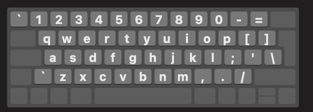
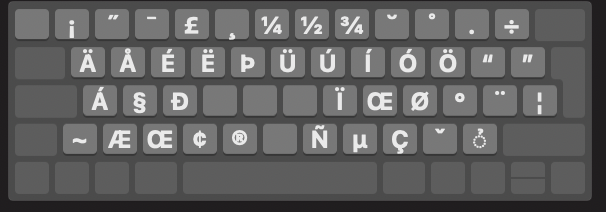

# US International Keyboard Layout with Alt/Option as dead key

By default MacOS only comes with Apples custom interpretation of an US Intl Keyboard layout. While the layout itself may be nice, it breaks with habits and muscle memory. This is especially true if you need/want to work on two different operating systems at the same time (e.g. Linux or Windows).

Therefore, I created this custom keyboard layout using [Ukelele](https://software.sil.org/ukelele/). It's key differences are:

- CTRL (`^`) and FN keys are swapped
- the option modifier can be used for special characters:
  - `option + q -> ä` (use shift for upper case)
  - `option + y -> ü` (use shift for upper case)
  - `option + p -> ö` (use shift for upper case)

## Overview

## Installation

Place the layout file in the layout directory used by MacOS:

`sudo cp ./us-altgr-intl.keylayout /Library/Keyboard\ Layouts/`

Reboot the machine afterwards.

## Modification

Just open the file **us-altgr-intl.keylayout** with Ukelele.
